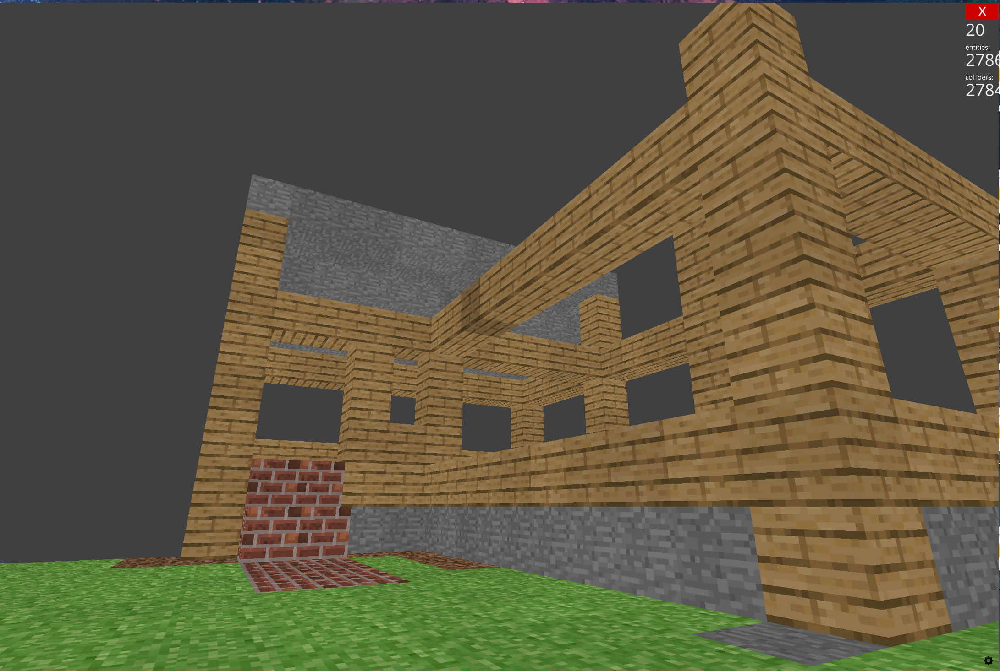

## 🎮 Controls

### Movement & Camera
- **W / A / S / D** — Move
- **Mouse / Trackpad** — Look around
- **Space** — Jump

### 🧱 Block Selection
- **1** — Grass  
- **2** — Dirt  
- **3** — Brick  
- **4** — Wood  
- **5** — Stone  

### 🛠 Block Actions
- **Left Click** — Place block  
- **Right Click** — Destroy block  

### 💾 Save System *(if enabled)*
- **Shift + S** — Save game  
- **Shift + L** — Load game


(Image taken before Sky fixed)


### Requirements
- Python 3.9+

### Dev Tools
- `tools/generate_controls_image.py` — generates the controls reference image using Pillow

# Setup
```
python -m venv .venv
```
```
.venv\Scripts\Activate.ps1
```


Reccomended Python 3.9–3.12 installed.

```
pip install ursina
```

If you’re on macOS/Linux and pip doesn’t work, try:

```
pip install ursina
```

## File Structure
```
root
├── game.py             # Run this to play
│
├── tools/               # dev utilities 
│   └── generate_controls_image.py
│
├── assets/
│   └── controls.png     
│
├── README.md
├── requirements.txt
└── .venv/              #(.gitignore)
```
<!-- TODO: Refactor and test -->
<!-- ```
root
│
├── src/                 # actual game code
│   └── main.py
│
├── tools/               # dev utilities 
│   └── generate_controls_image.py
│
├── assets/
│   └── controls.png     # generated output
│
├── README.md
├── requirements.txt
└── .venv/
``` -->
